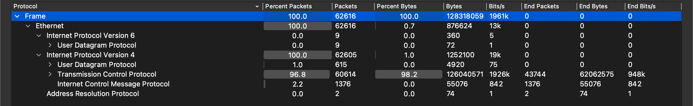
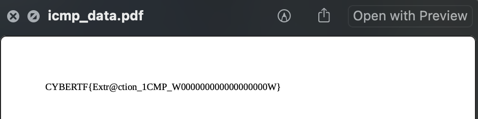

## Exfiltration (250 Points)

### Problem
```
karmenovie has managed to exfiltrate a file from a critical post we would like to know what it is.

file: chall.zip
```

### Solution
Unzipping the `chall.zip` we get the following:

```
$ ls chall/
chall_split.pcapng  chall_split1.pcapng chall_split2.pcapng chall_split3.pcapng chall_split4.pcapng
```

5 different pcapng files. The easiest thing to do instead of reviewing them individually, is to merge them together using `mergecap`.

```
mergecap -w merged.pcapng *.pcapng
```

There are no captured objects from HTTP traffic so instead let's check out the protocols captured in Wireshark by doing `Statistics > Protocol Hierarchy`.



We can see some UDP traffic using IPv6, and some UDP, TCP, and ICMP traffic using IPv4.

Nothing really sticks out to me so I do some Googling.

I came across a [CTF Writeup](https://ctftime.org/writeup/8727) that noticed suspicious ICMP traffic and managed to extract a file from it. Why not try to do the same?

The author of the writeup used `tshark` for this, so I will take their command and modify it to suit me.

```
$ tshark -Y "(icmp.type == 8)" -T fields -r merged.pcapng -e data | xxd -r -p | xxd -r -p

%PDF-1.4
%äüöß
2 0 obj
<</Length 3 0 R/Filter/FlateDecode>>
stream
x����
A
 ��<Eja�do�B�N�

 ...
 ...
 ...

 0000009936 00000 n
0000010233 00000 n
0000010330 00000 n
trailer
<</Size 14/Root 12 0 R
/Info 13 0 R
/ID [ <CDACD80E40AC3FA4B813114FD11FFBDA>
<CDACD80E40AC3FA4B813114FD11FFBDA> ]
/DocChecksum /C1F665ACA5272113B731320AE00BBDF0
>>
startxref
10505
%%EOF
 ```

Okay wow, this looks like a valid PDF file. I've added `...` to not bore you with useless data. The header and the footer look fine to me, so let's `>` this into `icmp_data.pdf` and try open it.



Very nice!


Flag: `CYBERTF{Extr@ction_1CMP_W000000000000000000W}`
