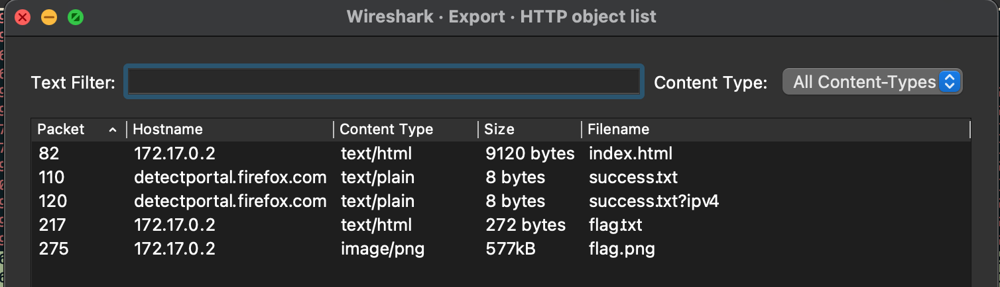
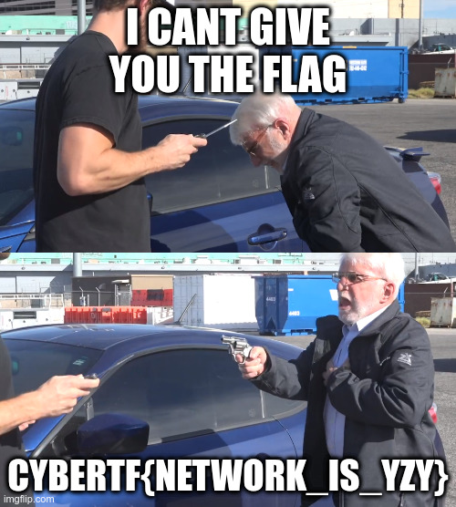

## YZY (50 Points)

### Problem
```
YZY:
We have retrieved a capture we believe has important data in it

file: capture.pcapng
```

### Solution
We're supplied with a `capture.pcapng` file so let's open that up in `Wireshark`.
I see some TCP traffic and also some HTTP traffic.

Usually when I see HTTP traffic, the first thing I check are the objects captured i.e. images, text files, http files etc.

To do this in Wireshark we can do `File > Export Objects > HTTP`.



`flag.txt` is a red herring, it's leads us nowhere, but `flag.png` is exactly what we need. We can click `Preview` or `Save` in Wireshark to view this.



This is a very nice challenge for beginners using Wireshark.

Flag: `CYBERTF{NETWORK_IS_YZY}`
