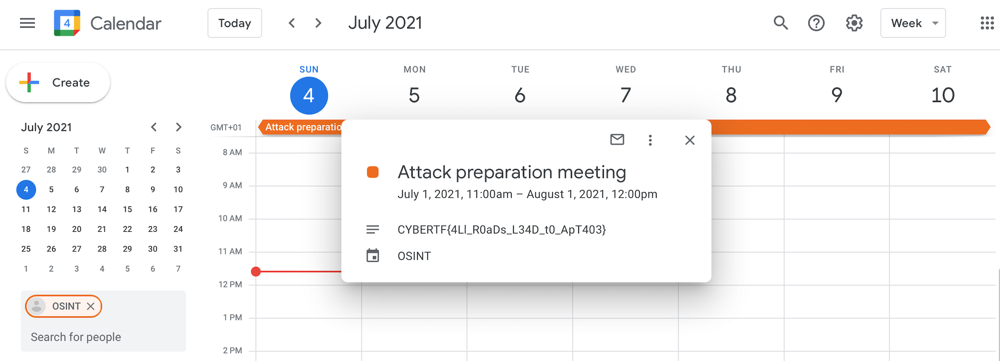

## I Love Google (250 Points)

### Problem
```
Our agents have managed to recover the phone number of a member of APT403.

We have it on good authority that they are organizing an attack and that a meeting is planned.

Tracking down his Gmail account with a little bit of public information will give us information on the location and date of their meeting.

+33 7 56 91 98 60
```

### Solution
OSINT is one of my favourite CTF categories. Let's go!

We have a French phone number, and after some online searching I don't see any useful results.

I tried a couple of Python tools which reverse search phone numbers, but none gave me any useful information, except for [Ignorant](https://github.com/megadose/ignorant).

```
$ ignorant +33 756919860

********************
   ++33 756919860
********************
[+] snapchat.com
```

So our APT403 Member has a Snapchat account. I added this number to my contacts and viewed it on Snapchat.


Great! Now we know his username is `vieniati`. From `Rush B`, I know a useful tool for looking up usernames is [Sherlock](https://github.com/sherlock-project/sherlock).

```
$ python3 sherlock vieniati

[*] Checking username vieniati on:
[+] GitHub: https://www.github.com/vieniati
```

After examining his GitHub account, we see he has one repo called `0day`. This doesn't contain anything interesting, but we still need to find his email address, so I'll clone the repo and run `git log` to see if the email address is in the log.

```
$ git log

commit 0cb42932411d682ed3c6be676bd55564bc7b0684 (HEAD -> main, origin/main, origin/HEAD)
Author: vieniati <83759363+vieniati@users.noreply.github.com>
Date:   Thu May 6 14:34:14 2021 +0200

    Update README.md

commit 7ca5552c3d1cc4e49286f98d8aeb0d54e2e03379
Author: vieniati <vieniati.832.h4cker@gmail.com>
Date:   Thu May 6 11:51:29 2021 +0200

    first commit
```

Aha! We have the email! `vieniati.832.h4cker@gmail.com`

The next step took a while to figure out, but the challenge asked us to find information about a meeting he has planned.

We have a Gmail account? Why not check if he has his Google Calendar made public?



Gotcha!

Flag: `CYBERTF{4Ll_R0aDs_L34D_t0_ApT403}`
