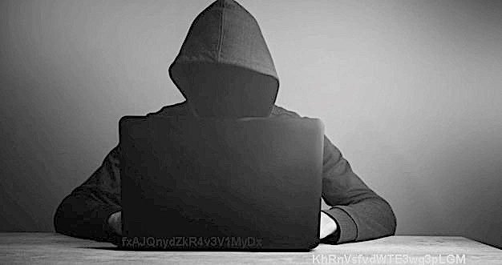
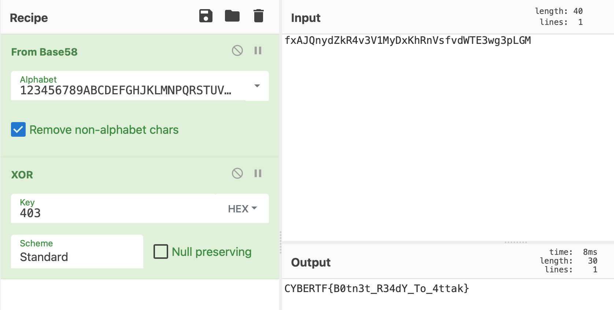

## Communication Interception (300 Points)

### Problem
```
Hello CTF-Agent,

We found a supsicious image in the phone of an APT-403's member.
We are counting on you to decrypt this message and prevent an incoming attack.

file: ВАЖНЫЙ.jpg
```

### Solution
Firstly, the filename is annoying so I renamed it to `stego.jpeg`.

Usually in a stego challenge when I'm given a `jpeg` file, I will look to use `binwalk` or `stegoveritas` as I think they provide the best results (that's if the flag isn't found using `strings`).

Stegoveritas gives us back some useful information in this case. We get a `zip` file, an empty `txt` file, and a corrupt `jpeg`.

The `zip` is password protected, but that won't stop us. Let's use `zip2john` to get the hash, and then `john` to crack it.

```
$ zip2john 110E4.zip > hash
ver 2.0 efh 5455 efh 7875 110E4.zip/last_image.jpg PKZIP Encr: 2b chk, TS_chk, cmplen=26854, decmplen=28204, crc=D33B2437
ver 2.0 efh 5455 efh 7875 110E4.zip/Transmission.txt PKZIP Encr: 2b chk, TS_chk, cmplen=149, decmplen=272, crc=63A3C158

NOTE: It is assumed that all files in each archive have the same password.
If that is not the case, the hash may be uncrackable. To avoid this, use
option -o to pick a file at a time.
```

`john` cracks this very fast, `computer` was the password.

```
110E4.zip:computer::110E4.zip:Transmission.txt, last_image.jpg:110E4.zip

1 password hash cracked, 0 left
```

Inside our `zip` file we get two pieces of information. An image `last_image.jpeg` and a `Transmission.txt`.

The text file reads

```
|---------------------------|
| КОНФИДЕНЦИАЛЬНЫЙ ДОКУМЕНТ |
|---------------------------|

Начало передачи
- .... ...-- ..--.- .--.-. - - ....- -.-. -.- ..--.- .. ... ..--.- -.-. ----- -- .---- -. --.
Конец передачи
```

The morse translates to `TH3_@TT4CK_IS_C0M1NG` and at first I thought this was the flag, but I was wrong.

In the image, two pieces of text are barely visible, so let's edit this to make it more clear.



That's better. Our two pieces of text are `fxAJQnydZkR4v3V1MyDx KhRnVsfvdWTE3wg3pLGM`.

The hint for the challenge mentions there are `58` possible solutions for this. 58 must mean Base58.

After Base58 decoding, we get the following:

`ZFWx34mswQs7$ZW/\tw4b+~`

Doesn't look like a flag just yet. But it doesn't look like complete garbage. I tried a few things out but after a little bit of guesswork, I figure this must just be XOR'd with some key.

The CTF revolves around a malicious group called `APT-403` so I tried some variations of this as the key and `403` was the magic hex in this case.



Flag: `CYBERTF{B0tn3t_R34dY_To_4ttak}`
