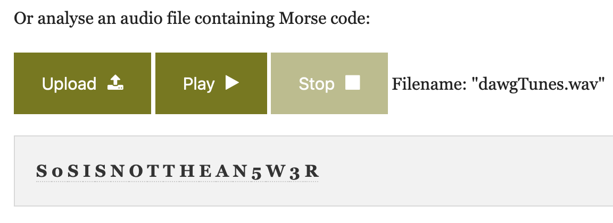

## Deserted Island Toolkit (150 Points)

### Problem
```
What would a drunken sailor do? (Wrap the output in DawgCTF{ })

DesertedIslandToolkit.zip: https://drive.google.com/file/d/1vYUIAPIeQgE6x781tH6SU3uU0YSx5Yxv/view?usp=sharing
```

### Solution
We're given a ZIP File. Inside it is one file called `dawgTunes.iso`, and opening that, there's one file called `dawgTunes.cdda`.

I've never heard of CDDA files, but I see it's an audio file so I import it to Audacity to take a look/listen.
Sounds like Morse Code to me? I'm not fluent in Morse personally so I had to do some Googling for decoders using audio files.

I came across [this one](https://morsecode.world/international/decoder/audio-decoder-adaptive.html) but I need to upload as a WAV file, so I exported from Audacity as a WAV file and uploaded it there and clicked Play.




Flag: `DawgCTF{S0SISNOTTHEAN5W3R}`
