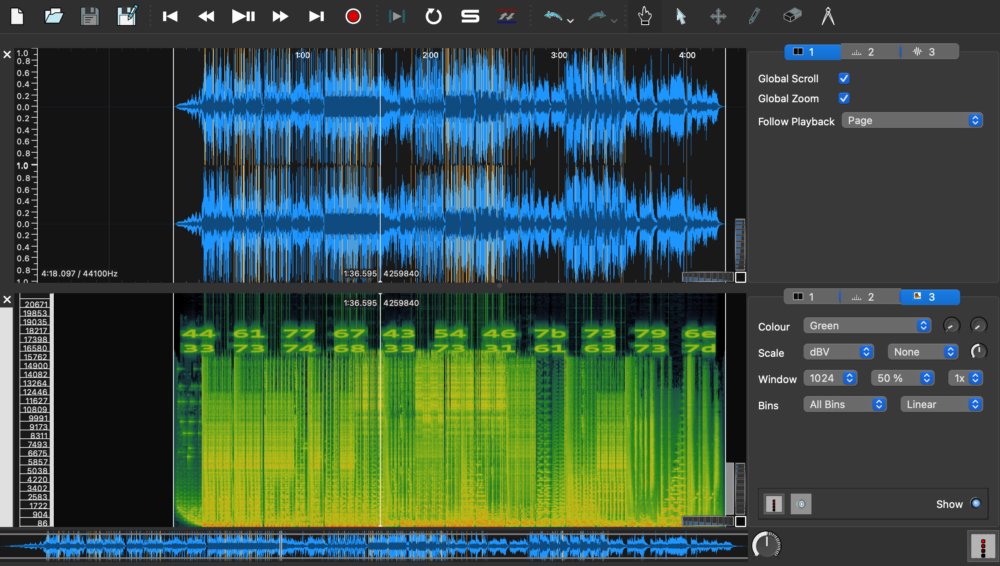

## Third Eye (75 Points)

### Problem
```
This beat is making me see things that I didn't think I could see...

third_eye.mp3: https://drive.google.com/file/d/13Je41zqYscApr-f6GJ5kC8RjeRP6hjUi/view?usp=sharing

```

### Solution
This is the first Audio challenge I've done! Exciting! The challenge name immediately brought me to the idea of checking out the waveform/spectogram of the linked MP3 file.
I've used Audacity in the past for old university music programming assignments, so I went there first and looked at the waveform and spectogram. I couldn't see anything here, so I went to Google to do some digging.
I came across a John Hammond [video](https://www.youtube.com/watch?v=rAGkm4pv44s&t=261s) on Audio Spectograms. He mentioned using Sonic Visualizer for these type of challenges so I installed it and opened the MP3 file there.



I could see some Hex straight away, so I manually typed them out into a Hex -> ASCII converter and got the flag.


Flag: `DawgCTF{syn3sth3s1acs}`
