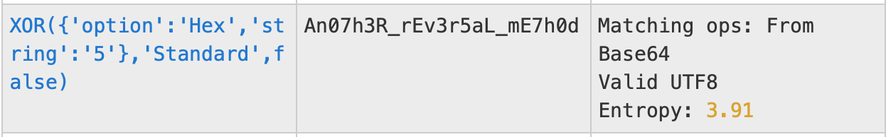

## BBomb Phase 2 (50 Points)

### Problem
```
Can you help me find my lost key so I can read my string

Dk52m6WZw@s6w0dIZh@2m5a
```

### Solution
From the off, the cipher used doesn't ring any bells. My go-to in these scenarios is just to give it a run through Magic mode from [CyberChef](https://gchq.github.io/CyberChef/) with Intensive enabled.

Immediately, you can spot the plaintext from the Output.




Flag: `DawgCTF{An07h3R_rEv3r5aL_mE7h0d}`
