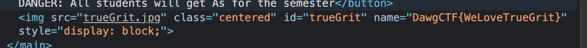

## Dr Hrabowski's Great Adventure (150 Points)

### Problem
```
President Freeman Hrabowski is having a relaxing evening in Downtown Baltimore. But he forgot his password to give all UMBC students an A in all their classes this semester! Find a way to log in and help him out.

http://umbccd.io:6100

(If you get an SSL error, try a different browser)
```

### Solution
At the time of writing this, the URL doesn't seem to work. But initially, you are greeted with a very simple login page. Given that there are no credentials readily available to us or hiding in the source code, I'm guessing we need to exploit this.
For most SQL Injection challenges, I usually try a few variations of `' OR 1=1'` to see how the site behaves.

My first attempt was username `admin` password `' OR 1=1'` and in the HTML I noticed some MySQL error get appended.
```html
<b>Warning</b>:  mysqli_fetch_array() expects parameter 1 to be mysqli_result, bool given in <b>/var/www/html/index.php</b> on line <b>13</b><br />
```

I'm on the right track at least. Maybe we can inject on both the username and password field?
After some iterations, my working exploit was to use `'OR 1=1 --` as both the `username` and `password`.

Next came the home page where you're asked to click a big red button. You click that and an image appears of True Grit, the UMBC mascot. Looking at the HTML, you can see the flag easily in the `name` field of the image.




Flag: `DawgCTF{WeLoveTrueGrit}`
