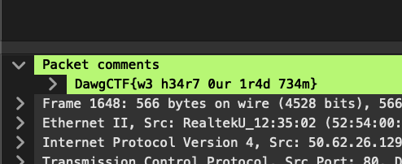

## Just A Comment (50 Points)

### Problem
```
Just a comment, we love our people here at ClearEdge!

justacomment.pcapng: https://drive.google.com/file/d/1vcLdCLi-zYTe_WPtXyu2Gr3rM0a3Ct7h/view?usp=sharing
```

### Solution
Investigating `pcapng` files isn't my strong point, I've only used Wireshark a few times in the past.
I spent a couple of minutes looking through HTTP traffic for clues before giving up. I went to Google to see if it's possible to find comments in pcapng files. I found a [thread](https://osqa-ask.wireshark.org/questions/16420/searchingfiltering-comments-on-packets-in-pcap-ng-file/) around this exact topic.

Great news, there's a built in `pkt_comment` filter in Wireshark, let's give that a shot.
1 result came back, and upon expanding the `Packet Comments`, hoorah!



Flag: `DawgCTF{w3 h34r7 0ur 1r4d 734m}`
