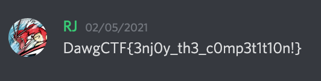

## DawgCTF Discord (5 Points)

### Problem
```
Please join the DawgCTF Discord using the link below:

https://discord.gg/TbJQXJb6

You can use it for discussing challenges, getting assistance from challenge authors, and networking with our sponsors! The flag for this challenge is located in the #flag channel.
```

### Solution
Tricky Challenge. I was stumped by this. After about 3 hours of digging through CTF resources, I did a deep dive into the DawgCTF Discord and analyzed each channel. I eventually found the flag hidden within the #flag channel:




Flag: `DawgCTF{3nj0y_th3_c0mp3t1t10n!}`
