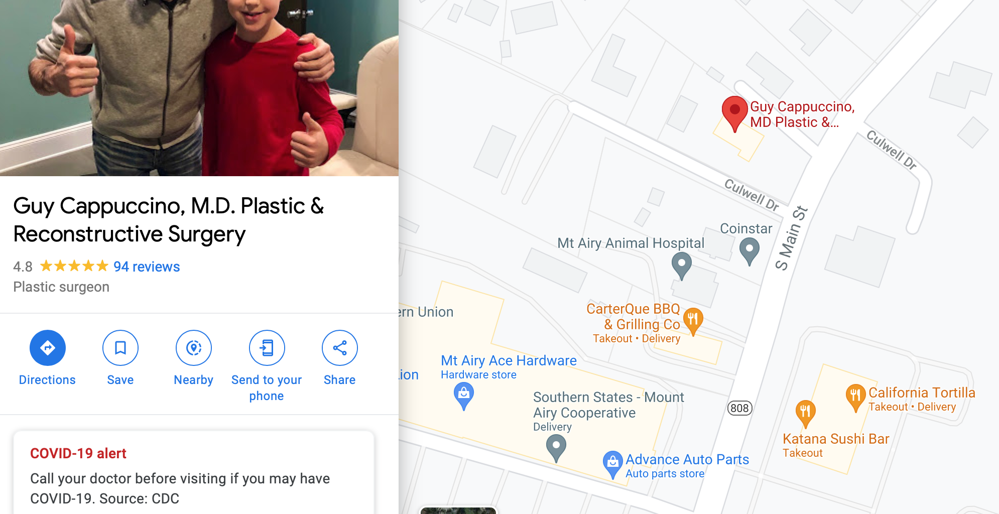

## Identifications (125 Points)

### Problem
```
Hey man. I'm standing in front of this Verizon central office building. What's its CLLI code?

What? No, I don't know where I am, my GPS is broken. I tried to connect to some Wi-Fi so I could download a map or something, but I don't know the password to any of these networks.

identifications.7z: https://drive.google.com/file/d/1YkzVIwbNKWKG4I0K8F_J8DCC9mqBn2ET/view?usp=sharing

Once you figure out the CLLI code, make sure to wrap it in DawgCTF{}.
```

### Solution
Firstly, let me start by saying this was my favourite challenge of the DawgCTF. I felt like I was playing an elaborate game of GeoGuessr.

We're given two images from the get-go. One was the front of a Verizon building, and the other was a list of nearby WiFi Networks.


I saw networks like `Dunkin' Donuts Guest` but I wasn't bothered focusing on this - How many Dunkin Donuts are there in the U.S? (8500 apparently)
I picked some niche ones like `DrCappuccino` and `katanasushi` and I looked them up on Google Maps.



There were only two results for `Dr Cappuccino` and one of them was in Maryland so it made sense to look at this one. Look at that! Right across the road is `Katana Sushi`.

I hopped into Street View because I couldn't see any Verizon references on the map.


There it is, in all its glory, the Verizon building from the given image!
I went back to Maps, clicked the building, noted its address `1305 S Main St, Mt Airy, MD 21771, USA`.

I'm not from America, I haven't got a clue what a CLLI code is, so it took a lot of random Googling of CLLI Lookups to stumble upon [Telcodata](www.telcodata.us) and more particularly, their section for [Switch Listings by ZIP Code](https://www.telcodata.us/search-switches-by-zip-code). I searched the ZIP Code from the address on Maps (`21771`).


Our address from Google Maps mentioned Main Street Mount Airy, so I took the CLLI `MTARMDMARS1` and hoped for the best. Boom! It worked! Nice.


Flag: `DawgCTF{MTARMDMARS1}`
