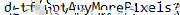

## Behind The Scenes (400 Points)

### Problem
```
Looks like a behind-the-scenes screenshot of the process behind this challenge was leaked. Can you use it to your advantage? (flag does not contain numbers)
```


### Solution
At first when I looked at this challenge, I spent time digging around the `PNG` data to see if it contained any secret data or files. I hit a dead end quite quickly here.

I went back and examined the image to see if anything stood out. It looked like they were on macOS but running Windows 10 in another app. You can see they have Notepad open in Windows with a `Password`, but it's pixelated. Damn, another dead end, right? Apparently not.

I did a quick search to see if there were de-pixelating tools out there and came across a couple articles/blogs about [Depix](https://github.com/beurtschipper/Depix), a Python tool specifically made to de-pixelate Notepad text.

I cropped down my original image so it was just the pixelated rectangle and passed that into the tool testing a lot of the options listed. Windows 10 Close and Windows 10 Close & Spaced worked best here.


I got some results that seemed promising, but I couldn't make them out fully.


Then, an admin on Discord had mentioned that there some participants were retrieving incorrect outputs when following the intended solution for the challenge. I gave them a ping to see if my output was falling into that category.. it was!

Admin sent me the expected output from Depix and it was easy to read the flag from here.



Flag: `dctf{GotAnyMorePixels}`
