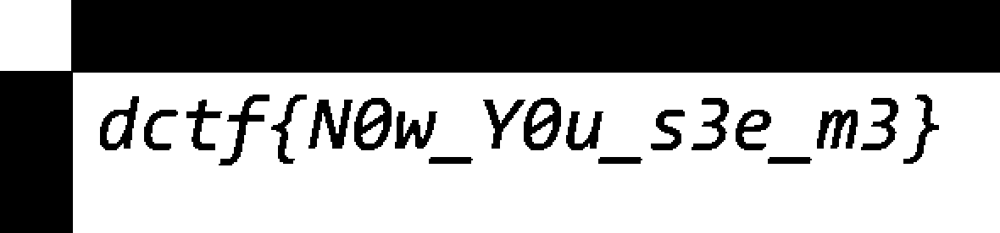

## Dragon (100 Points)

### Problem
```
Hiding in plain sight.
Tag: stego
Image: dragon.png
```

### Solution
Cool cool, another steganography challenge! Hiding in plain sight indicates that this is more to do with the image itself rather than its data. I use `stegsolve` to inspect images where I suspect the flag is hidden behind layers.

After clicking through a few of the options on `stegsolve`, the flag was easily viewable - I personally used `Grey Bits`.



Flag: `dctf{N0w_Y0u_s3e_m3}`
