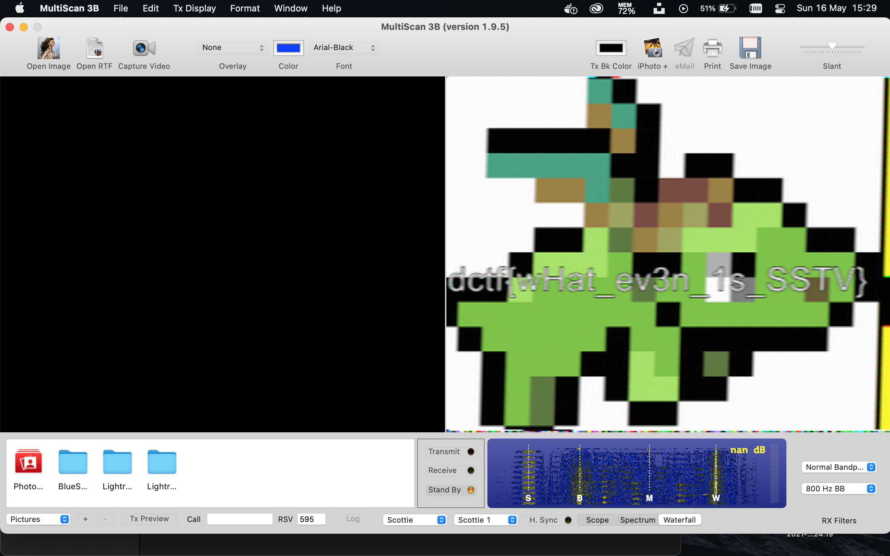

## Extraterrestrial Communication (200 Points)

### Problem
```
Aliens have recently landed on the moon and are attempting to communicate with us. Can you figure out what they are trying to tell us?

Hint: On a completely unrelated note, did you know how they transmitted the first image from the moon?

File: A_message_from_outer_space.mp3
```

### Solution
Aw, man. I went down the rabbit hole on this one before eventually finding the flag. I dug through pretty much every setting in Audacity and Sonic Visualiser and every audio decoder I could find online.

I was scratching my head, nothing was working. I read countless articles from NASA, NatGeo, and the likes, around how the original moon images were transmitted via radio signals back to NASA stations across Earth where they were decoded.

I then came across an [Instructables article](https://www.instructables.com/Decode-Digital-Radio-Signals-From-Earth-or-Space/) on decoding images sent from space radio signals from Earth using SSTV.
I did some digging on SSTV and listened to sample signals and noticed that PD120 signals had the same dial-up-style sounds that our audio did.
A lot of the popular decoding tools were only on Windows / Android. I found a [tutorial](http://www.esa.int/ESA_Multimedia/Videos/2020/07/Mac_OSX_tutorial_How_to_receive_SSTV_pictures_from_the_International_Space_Station) from the European Space Agency on how to get set up on macOS using `MultiScan 3B` and `Soundflower`. This was perfect, thankfully I didn't have to risk it all on dodgy sourceforge installs 😳

`Soundflower` was essential for this to work as any low hum picked up by the external microphone would interfere with the transmission and we wouldn't be able to decode successfully. `Soundflower` lets us reroute audio directly to applications rather than through speakers.

Once `MultiScan 3B` was set up it was just a matter of setting my audio channels correctly and to play the `MP3` file the whole way through and recover the original image containing the flag.



A very **very** cool challenge, shoutout to the admin of this, and hey, if I ever feel like listening in to the International Space Station when they do SSTV transmissions (apparently this is actually quite regularly), I'm fully set up!

Flag: `dctf{wHat_ev3n_1s_SSTV}`
