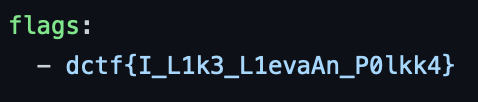

## Leak Spin (100 Points)

### Problem
```
We have confident insider report that one of the flags was leaked online. Can you find it?

Hint: The organisers only control a limited amount of places on the internet, looks through those...
```

### Solution
Great, this sounds like an `OSINT` challenge really. My first idea is GitHub or the DragonSec's website here, it makes the most sense given the description.

I go to [DragonSec's Github](https://github.com/DragonSecSI) and look at their repositories.
Aha, there's a Leak Spin repo...


And inside the repo is a `challenge.yml` file that contains...



Nice.

Flag: `dctf{I_L1k3_L1evaAn_P0lkk4}`
